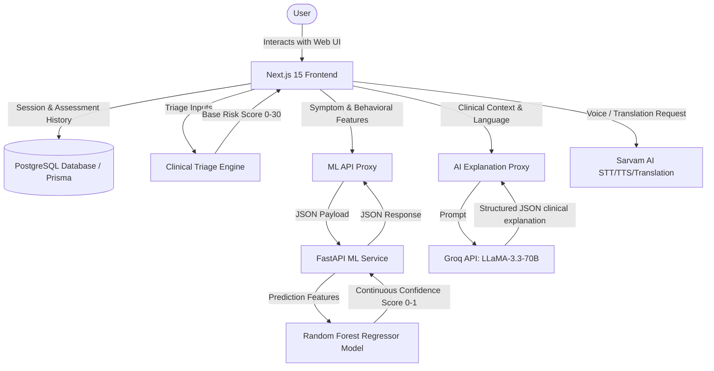

# SymptoSense 🩺

**SymptoSense** is a high-fidelity, professional-grade healthcare SaaS platform designed for smart symptom triage, health monitoring, and confidence-driven clinical decision support. Built with a focus on visual excellence, clinical reliability, and cross-platform accessibility, SymptoSense provides users with an instant, data-driven assessment of their health risks combined with AI-generated reasoning.

---

## 🏗️ System Architecture

The following diagram illustrates the data flow and integration between the Next.js frontend, the PostgreSQL database, the FastAPI machine learning service, and third-party AI APIs (Groq and Sarvam AI):



---

## ✨ Key Features

### 🧠 Advanced Triage Engine
- **8-Question Weighted Algorithm**: Evaluates age, symptoms, severity, duration, progression, and clinical indicators to calculate a precise risk score (0-30).
- **Multilingual Support**: Fully localized interface and engine supporting **English**, **Hindi (हिन्दी)**, and **Marathi (मराठी)**.
- **Family Profiles**: Manage assessments for yourself or managed family members, each with distinct health histories.

### 🤖 Machine Learning Confidence Engine
- **Random Forest Regressor**: Predicts the statistical reliability (0-1) of the triage assessment.
- **Dynamic Feature Set**: Analyzes patient demographics, symptoms, and dynamic behavioral features (symptom intensity, consistency, progression, answer confidence proxy, and ambiguity score).
- **Shortcut Prevention**: Trained using feature dropout on the rule-based risk score to ensure the model makes independent clinical evaluations.
- **Tiered Confidence Levels**: Translates predicted scores into actionable levels: **High** ($\ge 0.80$), **Medium** ($0.55\text{--}0.80$), and **Low** ($< 0.55$).

### 💬 AI Clinical Reasoning (Groq Integration)
- **Llama 3.3 (70B) Model**: Generates language-specific clinical reasoning, risk summaries, contributing factors, and next steps.
- **Resilient Fallback System**: Seamlessly switches to local, language-aware rule engines if API limits or timeouts are reached.
- **Zero Diagnosis Policy**: Strictly structured to guide patients on urgency and next steps without making medical claims or prescribing drugs.

### 🎙️ Voice & Accessibility (Sarvam AI Integration)
- **Speech-to-Text (STT)**: Allows hands-free symptom reporting in native languages.
- **Text-to-Speech (TTS)**: Reads assessments aloud for visually impaired users.
- **Translation Services**: Translates responses dynamically to ensure seamless localized experiences.

---

## 🛠️ Technology Stack

### Frontend & Core
- **Framework**: Next.js 15 (App Router)
- **Styling**: Vanilla CSS (Custom "Deep Crimson" design system) + Tailwind CSS (Utility classes)
- **Database ORM**: Prisma (configured for SQLite/PostgreSQL)
- **State Management**: React Context API (`AppContext`)

### Machine Learning Service
- **Framework**: FastAPI (Python)
- **Modeling**: scikit-learn (RandomForestRegressor), pandas, numpy, joblib
- **Visualization**: matplotlib (for checking prediction distributions)

---

## ⚙️ Machine Learning Engine Details

The ML service assesses how "confident" the system is in the triage outcome. For example, if a patient reports highly inconsistent symptoms, high ambiguity, and rapid symptom progression, the confidence score drops, signaling that they should consult a physician regardless of the computed risk level.

### Model Architecture & Hyperparameters
The model is a **Random Forest Regressor** optimized for covering high-confidence and boundary regions:
- **Estimators (`n_estimators`)**: 250 trees
- **Max Depth (`max_depth`)**: 12 levels
- **Min Samples Leaf (`min_samples_leaf`)**: 6 samples
- **Max Features (`max_features`)**: `'sqrt'` (square root of total features)

### Input Features
The model takes 18 input features:
1. **Demographics**: `age_group` (0=child, 1=adult, 2=senior)
2. **Clinical Severity/Duration**: `severity` (1-3), `duration` (1-3)
3. **Core Symptoms**: `fever`, `cough`, `chest_pain`, `dizziness`, `fatigue` (binary flags)
4. **Comorbidities**: `diabetes`, `heart_disease` (binary flags)
5. **Rule Score**: `rule_score` (normalized score between 0.0 and 1.0)
6. **Risk Level**: `risk_level` (0=LOW, 1=MEDIUM, 2=HIGH)
7. **Behavioral Features**:
   - `symptom_intensity_score` (1.0 - 3.0 scale)
   - `symptom_consistency_score` (0.0 - 1.0 based on symptom similarity over time)
   - `symptom_progression` (0=improving, 1=stable, 2=worsening)
   - `answer_confidence_proxy` (0.0 - 1.0, user's self-assessed accuracy)
   - `ambiguity_score` (0.0 - 1.0, reflecting conflicting or vague inputs)
   - `multi_symptom_density` (fraction of active symptoms from the pool)

### Preventing Shortcut Learning
To ensure the ML model doesn't just memorize the rule score, training implements a **10% feature dropout** on `rule_score`, replacing it with a sentinel value of `-1.0`. This forces the Random Forest to learn decision patterns from the behavioral and secondary symptom features.

---

## 🚀 Installation & Setup

### 1. Set Up Environment Variables
Create a `.env.local` file in the project root:
```env
# Database Connections
DATABASE_URL="file:./dev.db"

# Authentication
NEXTAUTH_SECRET="your-nextauth-secret-key"
NEXTAUTH_URL="http://localhost:3000"

# AI Integrations
GROQ_API_KEY="your-groq-api-key"
SARVAM_API_KEY="your-sarvam-api-key"

# Machine Learning Service URL
ML_SERVER_URL="http://localhost:8000/predict-confidence"
```

### 2. Next.js Frontend Installation
```bash
# Install dependencies
npm install

# Run database migrations
npx prisma db push

# Start the Next.js development server
npm run dev
```
Open [http://localhost:3000](http://localhost:3000) to view the web application.

### 3. FastAPI ML Service Installation
Ensure you have Python 3.9+ installed:
```bash
# Navigate to ML service directory
cd ml-service

# Install python dependencies
pip install -r requirements.txt

# Run the FastAPI server
python server.py
```
The ML server will run on `http://localhost:8000`. You can access the automatic documentation at `http://localhost:8000/docs`.

### 4. Deploying to Production (Render + Vercel)

To ensure the machine learning model is accessible by the deployed frontend:

#### A. Deploy the FastAPI ML Service to Render
1. Ensure the `render.yaml` file in the project root is committed to your repository.
2. Go to your [Render Dashboard](https://dashboard.render.com/) and click **New** → **Blueprint**.
3. Select this repository. Render will automatically detect the `render.yaml` configuration and provision the service.
4. Once deployment succeeds, note down the provided Render service URL (e.g., `https://symptosense-ml-service.onrender.com`).

#### B. Deploy Next.js to Vercel
1. Since Vercel is a serverless platform, the local SQLite database file (`dev.db`) is ephemeral. To persist user accounts and history, update the database provider in `prisma/schema.prisma` from `"sqlite"` to `"postgresql"`.
2. Connect your repository to Vercel and create a new project.
3. Configure the following **Environment Variables** in Vercel:
   - `DATABASE_URL`: A hosted PostgreSQL database URL (from Supabase, Neon, etc.).
   - `NEXTAUTH_SECRET`: A secure random cryptographic secret.
   - `GROQ_API_KEY`: Your Groq API key.
   - `SARVAM_API_KEY`: Your Sarvam AI API key.
   - `ML_SERVER_URL`: Point to your deployed Render ML service endpoint (e.g., `https://symptosense-ml-service.onrender.com/predict-confidence`).

---

## 📂 Project Directory Structure

```
SymptoSense/
├── app/                      # Next.js App Router Pages & Layouts
│   ├── api/                  # API routes (ML Proxy, Groq Explanation, Sarvam AI)
│   ├── auth/                 # Sign-up & Login pages
│   ├── components/           # Main application screens (Dashboard, Results, etc.)
│   └── context/              # React Context for state management (AppContext)
├── components/               # Reusable UI widgets and component panels
│   ├── ai-question-engine/   # Voice-enabled, dynamic QA logic
│   ├── dashboard/            # Profile dropdown, sidebar, and history charts
│   └── questions/            # UI widgets for various question types
├── lib/                      # Business logic, engines, and utilities
│   ├── ai-engine/            # Triage scoring algorithm & clinical rules
│   └── db/                   # Prisma database adapters
├── ml-service/               # FastAPI ML Model Service
│   ├── server.py             # FastAPI entrypoint
│   ├── train_model.py        # Model training script
│   ├── generate_dataset.py   # Synthetic data generation engine
│   └── confidence_model.joblib # Trained model file
├── prisma/                   # Database schema definitions
└── public/                   # Static icons, symptom definitions, and manifests
```

---

## ⚠️ Disclaimer
**SymptoSense is a decision support tool and is not a replacement for professional medical advice, diagnosis, or treatment.** In case of a medical emergency, please contact local emergency services or visit a hospital immediately.

---

## 📄 License
This project is licensed under the MIT License.
